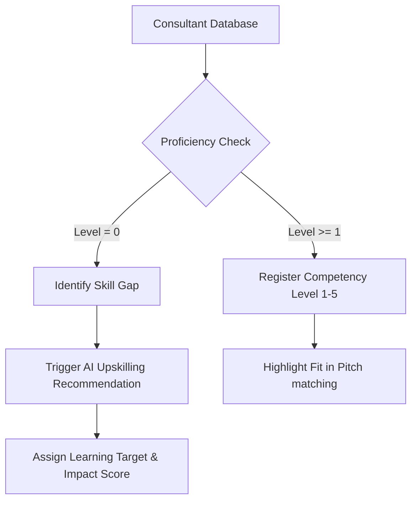

# BenchZero Agent & Skills Integration Guide

This guide details the skills intelligence architecture of the **ESN Operations Suite (BenchZero)**. It explains how consultant profiles are structured, how the skills gap matrix operates, and how the AI Pitch Engine matches profiles to client mission descriptions.

---

## 1. Skills Representation Model

Skills are modeled at two levels in the database:
1. **Free-form Skills Tagging**: A comma-separated string listing all certifications and tools.
2. **Core Proficiency Matrix Levels**: A structured scale (0-5) representing five high-demand technology sectors:
   * **React** (`reactProficiency`)
   * **Node.js** (`nodeProficiency`)
   * **DevOps** (`devopsProficiency`)
   * **AWS** (`awsProficiency`)
   * **Symfony** (`symfonyProficiency`)

### Scale Reference Table
| Level | Name | Description | UI Color Class |
| :---: | :--- | :--- | :--- |
| **0 / null** | Gap / None | Target skill is missing; candidate has no verified track record. | `.prof-gap` (Dashed Outline) |
| **1** | Novice | Basic theoretical knowledge or introductory certificate. | `.prof-1` (Light Blue) |
| **2** | Intermediate | Practical experience in simple project delivery. | `.prof-2` (Soft Blue) |
| **3** | Advanced | Independent feature implementation and code review competence. | `.prof-3` (Indigo Accent) |
| **4** | Expert | Architecture design, scaling configuration, and team guiding. | `.prof-4` (Deep Indigo) |
| **5** | Master | Expert consultant, system designer, or technical director. | `.prof-5` (Dark Navy) |

---

## 2. Dynamic Skills Heatmap Matrix

The **Skills Gap Heatmap** cross-references active bench consultants against the core proficiency matrix.



### Skills Gap & Upskilling Inference
If a consultant is on the bench and has a critical skill gap in a sector showing high pipeline demand, the seeder/system assigns:
* **Upskilling Target**: Specific course or certification to clear the gap (e.g., `AWS Cloud Practitioner`, `React Advanced`).
* **Upskilling Impact**: A projection of placeability gains (e.g., `+85% Placeability`).

---

## 3. The AI Pitch & Alignment Engine

The core intelligence resides in [PitchController.java](file:///Users/wecraft/Desktop/WORK/zero-bench/backend/src/main/java/com/benchzero/backend/controller/PitchController.java).

```
POST /api/pitches/generate
```

### Payload Structure
```json
{
  "consultantId": 5,
  "jobDescription": "We are seeking a senior engineer to modernize our legacy web portal and deploy automated pipelines on AWS."
}
```

### Match Logic & Scoring Algorithm
The pitch engine parses the Job Description (JD) text and performs keyword matching against the consultant's profile:
1. **Keyword Analysis**: Performs case-insensitive matching between the consultant's tags and the JD requirements.
2. **Match Score Calculation**:
   * **Base Score**: Starts at `70` for consultants with $\le 5$ years of experience, or `80` for $> 5$ years.
   * **Skills Boost**: Adds `+5%` per matched keyword.
   * **Boundaries**: Capped at `98%` to maintain AI recommendation realism.
3. **Alignment Extraction**:
   * If JD mentions **modernization**, **migration**, or **legacy**: Generates a *Modernization & Migration* alignment card.
   * If JD mentions **cloud**, **aws**, **azure**, or **devops**: Generates a *Cloud & Infrastructure Automation* alignment card custom-tailored to the consultant's stack.
   * If JD mentions **agile**, **squad**, **team**, or **lead**: Generates an *Agile Delivery & Squad Collaboration* alignment card.
   * **Default Fallback**: If no keywords match, generates a *Core Professional Alignment* card based on the consultant's primary stack.

---

## 4. API Reference for Coding Agents

Agents extending this codebase can use the following endpoints to automate operations:

### 1. Retrieve the Competency Directory
```bash
curl -X GET http://localhost:8080/api/consultants
```
*Retrieves all consultant objects containing skills arrays, proficiency levels, and active upskilling targets.*

### 2. Register New Profiles & Skills
```bash
curl -X POST http://localhost:8080/api/consultants \
  -H "Content-Type: application/json" \
  -d '{
    "name": "Alex Mercer",
    "title": "Cloud DevOps Specialist",
    "skills": "DevOps, Terraform, AWS, Docker",
    "yoe": 6,
    "benchStatus": "Available",
    "dailyRate": 700.0,
    "currency": "EUR",
    "reactProficiency": 1,
    "nodeProficiency": 2,
    "devopsProficiency": 4,
    "awsProficiency": 4,
    "symfonyProficiency": 0
  }'
```

### 3. Retrieve Recruitment Pipeline Items
```bash
curl -X GET http://localhost:8080/api/pipelines
```

### 4. Move Opportunities (Kanban Status Updates)
```bash
curl -X PUT "http://localhost:8080/api/pipelines/3/status?status=CV_SENT"
```
*Moves opportunity `3` to CV Sent column and auto-updates details text.*
